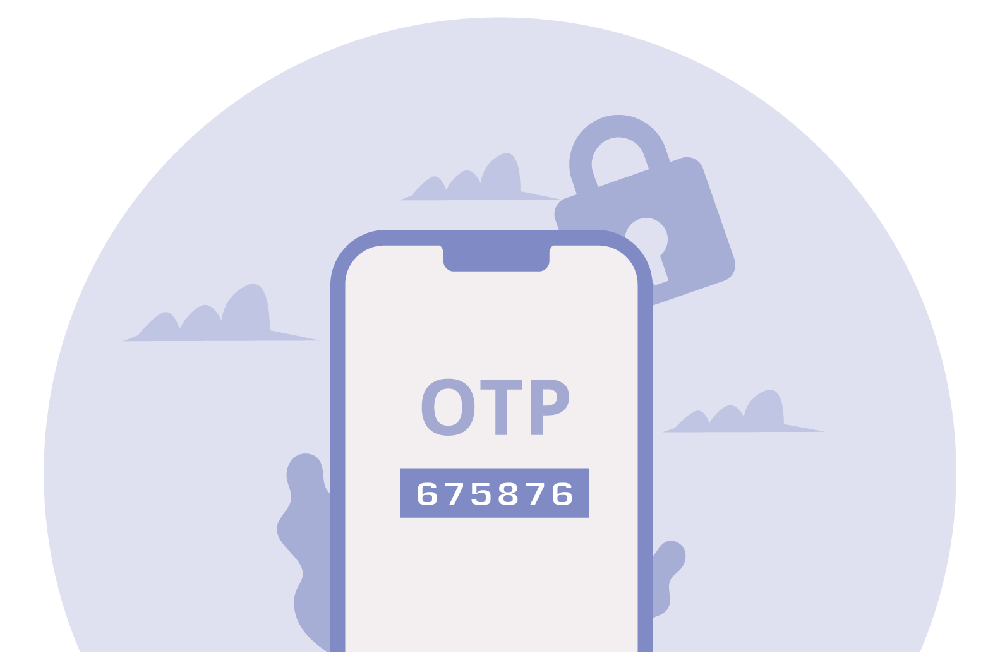

# 0x19. Postmortem: The Great OTP Odyssey 🚀✨

Greetings, tech voyagers! Grab your virtual swords and shields because we're about to delve into the epic tale of our backend's recent escapade - "The Great OTP Odyssey." Beware, for this journey is filled with misconfigurations, mischievous SMS gateways, and a quest for the elusive authentication codes! 🏹🛡

## Issue Summary:

### Duration:

*Chronicles of Chaos Begin:* Feb 16, 2024, 02:00 AM (UTC)  
*The Quest for Resolution Ends:* Feb 16, 2024, 04:30 AM (UTC)

### Impact:

As the dark clouds of misconfiguration loomed, our brave users found themselves stranded without their sacred OTPs. The login process came to a screeching halt, and 15% of our user base embarked on a quest for authentication in vain. 😱🔐

### Root Cause:

Alas, the mischievous culprit behind this chaos was none other than a misconfigured third-party SMS gateway, playing tricks on the delivery of our precious OTPs. 🤖📵

### Timeline:

- **2:00 PM:** A cry echoed across our support channels - users were lost without their sacred OTPs!
- **2:15 PM:** Our brave engineers, armed with keyboards and caffeine, began the quest. Initial suspicions fell upon the arcane rituals of OTP generation.
- **2:45 PM:** A detour into the labyrinth of network connectivity issues proved fruitless, as the real miscreant lurked in the shadows.
- **3:30 PM:** The call to arms reached the Integration Team as we faced the dire consequences of our users' plight.
- **4:00 PM:** The villain revealed! Misconfiguration in the SMS gateway - a foe more cunning than we had anticipated.
- **4:15 PM:** A tactical retreat! We switched to an alternate SMS gateway, ensuring our users weren't left stranded while we prepared to banish the misconfiguration demon.
- **4:30 PM:** Victory! The misconfiguration was vanquished, and our original SMS gateway, reformed and humbled, was once again entrusted with the delivery of sacred OTPs. 🏆💪

## Root Cause and Resolution:

### Root Cause:

A misconfiguration in the third-party SMS gateway integration led to the failure of OTP delivery, preventing users from receiving authentication codes.

### Resolution:

In a twist of fate, we temporarily switched to an alternate SMS gateway to restore OTP delivery while concurrently implementing a configuration fix in the original SMS gateway integration to prevent future occurrences. 🔄🔧

## Corrective and Preventative Measures:

### Improvements/Fixes:

1. 🛡 Implement automated tests for third-party integrations - the guardians of our digital realm!
2. 📡 Enhance monitoring for OTP delivery, keeping a vigilant eye on success rates and response times.
3. 🤝 Forge a stronger alliance with the third-party SMS gateway, establishing a communication protocol to swiftly repel any future misconfiguration invasions.

### Tasks to Address the Issue:

1. Communicate the incident details and resolution to affected users.
2. Conduct a comprehensive review of third-party integrations to identify and rectify potential misconfigurations.
3. Schedule regular audits of third-party integration configurations to ensure ongoing system stability.

## Conclusion:

Dear reader, as we close this epic chapter, let it be known that even in the darkest dungeons of misconfigurations, our resolve remains unbroken. May your systems be resilient, your integrations harmonious, and your users forever shielded from the chaos of missing OTPs!

So, join us in this grand tale of backend misadventures, where the heroes are engineers, the villains are misconfigurations, and the plot twists are as unexpected as a bug in production. Until our next saga unfolds, stay curious, stay vigilant, and may your code be ever bug-free! 🚀✨
